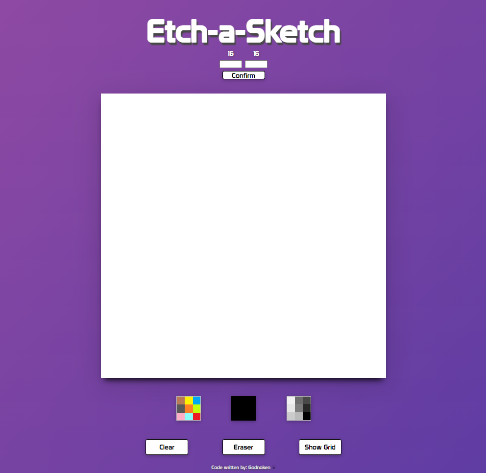

# Etch-a-Sketch
**Live** https://godnoken.github.io/etchasketch

**Note**:
I will have abused the DOM by writing more or less nothing in pure HTML. The reason behind this is to practice DOM manipulation and won't be seen in future projects.

## What will I make;

"Etch-a-Sketch" project according to TheOdinProjects rules found here: https://www.theodinproject.com/paths/foundations/courses/foundations/lessons/etch-a-sketch-project

## What I will learn;

More DOM manipulation, JavaScript and CSS.

## How will I do it;

**Note**:
The pseudocode underneath was for the MVP of the Odin project.
Regrettably no pseudocode was written for the extra features.

Initialize a 16x16 square grid as a div called "squareGrid" using CSS Grid and append it to the body
    Add id "squareGrid"

Initialize divs inside the container with a loop
    Add an event listener change the div(s) background color on hover

Initialize a button that clears the entire grid when clicked
    Add a prompt that asks the user for how many squares they want for their new grid. Limit at 40 for performance
    Add a function that reads the user's input and creates a new grid in the same space as the previous one

